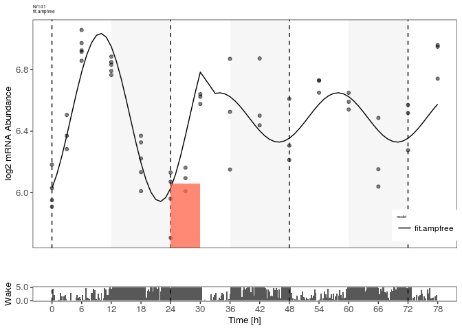
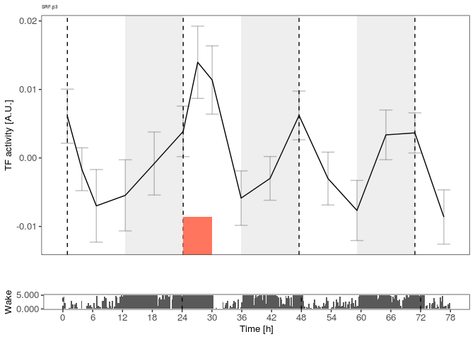

    # Jake Yeung
    # Date of Creation: 2019-11-28
    # File: ~/projects/SleepDepAnalysis/R/README.R
    # Make a nice README.md for people to see how to plot the data

    library(here)

    ## here() starts at /home/yeung/projects/SleepDepAnalysis

    setwd(here())

    source("R/functions/LoadData.R")
    source("R/functions/FitFunctions_Downstream.R")
    suppressMessages(LoadPrimetimeObjs())  # loads the processed data into R

    ## Loading objects:
    ##   dat.long.means
    ##   clstrs
    ##   cent.long.base
    ##   cent.long.full
    ##   mat.means.exprs
    ##   mat.means
    ##   wss
    ##   max.n
    ##   n.centers

    ## NULL

    act.zscore.lst <- LoadMaraOutput(act.dir = "data/sleep_deprivation_gene_exprs_all")  # load TF activity outputs

    ## Joining, by = c("gene", "sample", "time", "samp")

Explore the sleep deprivation data
----------------------------------

The expression dynamics of many genes can be accurately predicted from
sleep-wake history of mice:

    g <- "Egr2"
    print(PlotBestFit(subset(dat.long.shift, gene == g), subset(fits, gene == g), filt.time, g, wake.collapsed, low.pass.filt.time, dat.pred = NA, dat.eeg = dat.eeg.plot))

    ## [1] "Adding rectangle"

    ## Scale for 'x' is already present. Adding another scale for 'x', which
    ## will replace the existing scale.

    ## Warning: position_stack requires non-overlapping x intervals

    ## Warning: Removed 2 rows containing missing values (geom_bar).

    ## NULL

Interestingly, clock and clock output genes were affected by sleep
deprivation, often in a non-trivial manner:

    g <- "Nr1d1"
    print(PlotBestFit(subset(dat.long.shift, gene == g), subset(fits, gene == g), filt.time, g, wake.collapsed, low.pass.filt.time, dat.pred = NA, dat.eeg = dat.eeg.plot))

    ## [1] "Adding rectangle"

    ## Scale for 'x' is already present. Adding another scale for 'x', which
    ## will replace the existing scale.

    ## Warning: position_stack requires non-overlapping x intervals

    ## Warning: Removed 2 rows containing missing values (geom_bar).

    ## NULL

We used a model selection to infer genes that may be sleep-wake driven,
here's how to do the fits:

    g <- "Egr2"

    # HALF LIFE LIMITS
    min.hl <- 1/3
    max.hl <- 24
    min.hl.mrna <- 1/3
    max.hl.mrna <- 24

    lambda <- 1000
    jmaxiter <- 3000

    jtswitch <- 33
    jform <- "switch"

    fit.output <- subset(dat.long.shift, gene == g) %>%
      group_by(gene) %>%
      do(fit.sleep = FitProcessS(., wake.collapsed, exprs.cname = "exprs", time.cname = "time",
                                 condensed=TRUE, pseudo = 0, min.hl = min.hl, max.hl = max.hl,
                                 do.lowpass=TRUE, min.hl.mrna = min.hl.mrna, max.hl.mrna = max.hl.mrna,
                                 low.pass.filter.times = low.pass.filt.time, jlambda = lambda, jmaxit = jmaxiter),
         fit.flat = FitFlat(., use.weights = FALSE, get.bic = TRUE, condensed = TRUE),
         fit.circadian = FitRhythmic(., T.period = 24, use.weights=FALSE, get.bic=TRUE, condensed=TRUE),
         fit.ampfree.step = FitRhythmic.FreeAmp(., AmpFunc = AmpFunc, T.period = 24, tswitch = jtswitch, form = jform, include.intercept = TRUE, jmaxit = jmaxiter),
         fit.mixedaf = FitWeightedSFreeAmp(., AmpFunc = AmpFunc, wake.collapsed = wake.collapsed,
                                           exprs.cname = "exprs", time.cname = "time", T.period = 24,
                                           tswitch=jtswitch, form=jform, pseudo = 0, min.hl = min.hl,
                                           max.hl = max.hl, include.intercept = FALSE, do.lowpass=TRUE,
                                           min.hl.mrna = min.hl.mrna, max.hl.mrna = max.hl.mrna,
                                           low.pass.filter.times = low.pass.filt.time, jlambda = lambda, jmaxit = jmaxiter),
         fit.mix = FitWeightedSCircadian(., wake.collapsed, condensed = TRUE, pseudo = 0,
                                         min.hl = min.hl, max.hl = max.hl, include.mix.weight = FALSE,
                                         include.intercept = FALSE, do.lowpass=TRUE, min.hl.mrna = min.hl.mrna,
                                         max.hl.mrna = max.hl.mrna, low.pass.filter.times = low.pass.filt.time, jlambda = lambda, jmaxit = jmaxiter))
    fit.output <- AddBICToDat(fit.output)

    ## Warning: Grouping rowwise data frame strips rowwise nature

    ## Warning: funs() is soft deprecated as of dplyr 0.8.0
    ## Please use a list of either functions or lambdas: 
    ## 
    ##   # Simple named list: 
    ##   list(mean = mean, median = median)
    ## 
    ##   # Auto named with `tibble::lst()`: 
    ##   tibble::lst(mean, median)
    ## 
    ##   # Using lambdas
    ##   list(~ mean(., trim = .2), ~ median(., na.rm = TRUE))
    ## This warning is displayed once per session.

    fit.output$model <- SelectBestModel(fit.output, colnames(fit.output))  # Egr2 is sleep-wake driven gene

We inferred regulators underlying the dynamics of many of these genes

    act.long <- act.zscore.lst$act.long
    zscores <- act.zscore.lst$zscores
    zscores$motif <- factor(as.character(zscores$motif), levels = zscores$motif)
    zscores$label <- mapply(function(m, z) ifelse(z > 1.46, m, NA), as.character(zscores$motif), zscores$zscore)

We inferred that SRF may be driving many of the early-response dynamics

    jmotif <- "SRF.p3"
    act.means <- act.long %>%
      group_by(gene, time) %>%
      summarise(exprs = mean(exprs), sem = sqrt(sum(sem ^ 2)))
    PlotMara.withEEG(subset(act.means, gene == jmotif), dat.eeg.plot, jtitle = jmotif)

    ## [1] "Adding rectangle"

    ## Scale for 'x' is already present. Adding another scale for 'x', which
    ## will replace the existing scale.

    ## Warning: position_stack requires non-overlapping x intervals

    ## Warning: Removed 2 rows containing missing values (geom_bar).

